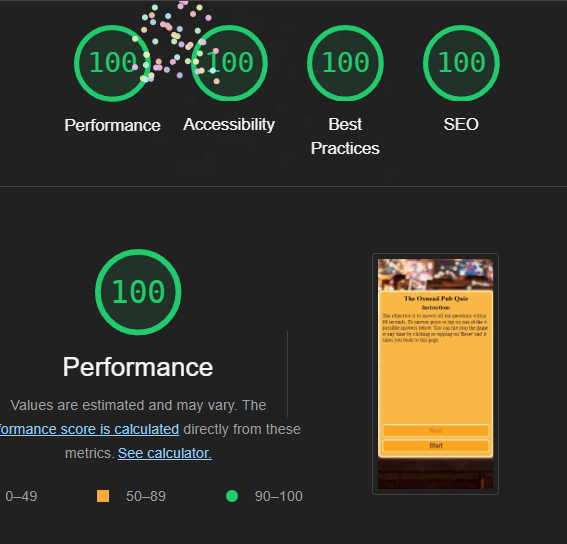

# The Oxnead Pub Quiz

The live website can be found [here](https://redfoxofwealden.github.io/oxnead-pub-quiz/).

## Contents

[Design](#design)

[Features](#features)

[Testing](#testing)

[Deployment](#deployment)

[Credits](#credits)

## Design

It is a game where the player has to answer all ten questions within sixty seconds. The game asks ten questins in random order, with each question being asked only once per gaming session. The user reponds to each question by tapping on one of the four buttons. Each of the 4 buttons display a possible answer in random order. The background colour goes green when the user selects the correct answer, red if the answer is wrong. After all the questions have been asked, a form will be displayed showing the score. A congratulatory message will be displayed if all the questions have been correctly. A \'Times Up!\' message will be displayed if the time has elapsed and the user has not answered all the questions. The user at any time can stop the game by tapping \'Reset\' and this will take it back to the home page.

### Detects whether javascript is supported on the browser

The first thing the website does is detect whether the browser supports javascript. If it does the form is display. Otherwise a no javascript support error message is displayed and does nothing afterwards.

## Features

### Home page

The Oxnead Pub Quiz features a Instructions, which also serves as a home page. This is also the page that the site returns to after the user taps or clicks on Reset button.

At the end of the game one of the three pages will be displayed depending on the score achieved.

If the user all the questions and gets one or more within the time limit it displays the score as shown below.

If the user does not answer within the time limit, the game will stop and the message shown below is displayed.

If the player gets all the questions right within the alloted time a congratulatory message is displayed as below.

### Features Left to Implement

There are no features left to implement.

## Testing

### Tests Performed

The following tests were carried out during the development of the game.

#### Testing during development

During the development the use of exception, i.e the use of the throw command, was used in functions where arguments are used. An exception would be generated if the arguments passes are not of the correct type, i.e. string, number, object, boolean etc.

1. Test event handlers after adding them to buttons
1. Test functions randoniser functions
1. Test start game feature
1. Test reset feature
1. Test score feature
1. Test finale message feature at the end of the game
1. Test timer feature

The testing was carried out repeatedly during development until no exceptions were generated and no bugs were found and no errors were encountered.

#### No Javascript support testing

To test how this website is displayed on a browser with no Javascript support, this site was deployed to GitHub.  Next the site was tested on Google Chrome with Javascript disabled. Disabling Javascript on Chrome was done as follows:

1. Go to the settings menu
1. Click on Privacy and security on the left menu
1. Click on Site settings
1. Click on Javascript
1. Click on the option 'Don't allow sites to use Javascript'

Javascript is now disabled and the testing of the site can be carried out. The site worked fine with no bugs detected. The message appears as shown below.

#### Test Background image

The background has been tested to ensure it covers the whole viewport in the browser.

#### Responsive Testing

The website was tested on Google Chrome using the responsive feature on web developer tools. The site was tested against these devices: iPhoneSE, iPhoneXR, iPhone Pro 12, Pixel 5, Samsung Galaxy S8+, Samsung Galaxy S20 Ultra, iPad Air, iPad Mini, Surface Pro 7, Surface Duo, Galaxy Fold, Samsung Galaxy A51/71, Nest Hub, Nest Hub Max, Facebook on Android v407 on Pixel 6.

#### HTML Validation Test

Test site used: [W3C HTML validation test site](https://validator.w3.org/#validate_by_input)

The attribute used on one the buttons, disabled, had to be changed from 'disabled="true", to 'disabled' to pass the html validation test.

No errors were found however six warnings have issued: most to do with empty headings and two to do with use of \'h1\' elements.

#### CSS Validation Test

Test site used: [W3C CSS Validation Service](https://jigsaw.w3.org/css-validator/#validate_by_input)

To pass the test the css property, translate, had to be changed to transform.

  

#### Javascript Validation Test

Test site used: [JSHint](https://jshint.com/)

The code was uploaded to JSHint, tested and no errors were found. However it issued 47 warnings all to do with ES6 features being used. It was then retested with New JavaScript features (ES6) option selected as shown below.

After retesting it issued one warning as shown below.

.

#### Lighthouse reports

The reports have been genereated using Google Chrome after deployment to GitHub: one for mobile devices, the other for desktop.

##### Mobile devices

##### Desktop devices

### Unfixed Bugs

There are no known bugs. All code was tested repeatedly during development until code is working correctly.

## Deployment

The website is deployed as follows:

- Navigate to oxnead-pub-quiz repository on github
- Click on settings
- Click on Pages under Code and automation on the left
- On GitHub Pages under Branch change the option from None to Main branch
- Click on Save button to deploy to GitHub

The website is now available [here](https://redfoxofwealden.github.io/oxnead-pub-quiz/).

## Credits

### Resources

The idea for the use of hasOwnProperty property was taken from [www.freecodecamp.org/news/how-to-check-if-a-property-exists-in-a-javascript-object](https://www.freecodecamp.org/news/how-to-check-if-a-property-exists-in-a-javascript-object/).

The use of short hand notation in find method of the array was copied and modified from MDN [developer.mozilla.org/en-US/docs/Web/JavaScript/Reference/Global_Objects/Array/find](https://developer.mozilla.org/en-US/docs/Web/JavaScript/Reference/Global_Objects/Array/find).

Also the use of find in arrays was taken from [www.w3schools.com/jsref/jsref_find.asp](https://www.w3schools.com/jsref/jsref_find.asp).

The use of the timer function used was taken from [www.w3schools.com/js/js_timing.asp](https://www.w3schools.com/js/js_timing.asp).

The use of the error objects to throw an exception was inspired and taken from MDN website: [developer.mozilla.org/en-US/docs/Web/JavaScript/Reference/Statements/throw](https://developer.mozilla.org/en-US/docs/Web/JavaScript/Reference/Statements/throw).

### Media

The background image was downloaded from [Pexels](https://www.pexels.com/).
The link to the background image is here: [www.pexels.com/photo/blue-harp-decor-on-brown-wooden-table-63633](https://www.pexels.com/photo/blue-harp-decor-on-brown-wooden-table-63633/).

The favicon used was download from Google Fonts website: [fonts.google.com/icons?selected=Material+Symbols+Outlined:sports_bar:FILL@0;wght@400;GRAD@0;opsz@24&icon.query=beer](https://fonts.google.com/icons?selected=Material+Symbols+Outlined:sports_bar:FILL@0;wght@400;GRAD@0;opsz@24&icon.query=beer)

The png file was then converted into a favicon using ionos website: [www.ionos.co.uk/tools/favicon-generator#tool](https://www.ionos.co.uk/tools/favicon-generator#tool).
