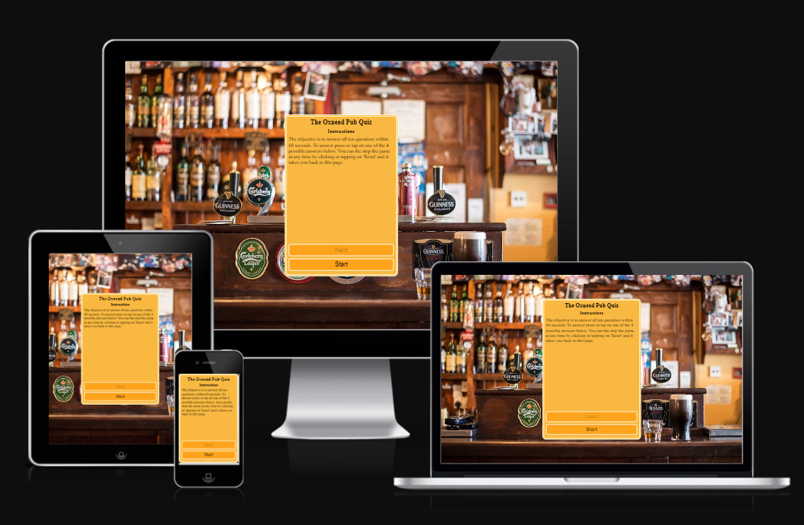

# The Oxnead Pub Quiz

The live website can be found [here](https://redfoxofwealden.github.io/oxnead-pub-quiz/).

## Contents

[Design](#design)

[Features](#features)

[Testing](#testing)

[Deployment](#deployment)

[Credits](#credits)

## Design

It is a game where the player has to answer all ten questions within sixty seconds. The game asks ten questins in random order, with each question being asked only once per gaming session. The user reponds to each question by tapping on one of the four buttons. Each button display a possible answer. The background colour goes green when the user selects the correct answer, red if the answer is wrong. After all the questions have been asked, a form will be displayed showing the score. A congratulatory message will be displayed if all questions have been correctly. A \'Times Up!\' message will be displayed if the time has elapsed and the user has not answered all the questions. The user at any time can stop the game by tapping \'Reset\' and this will take it back to the home page.

## Features

### Existing Features

### Features Left to Implement

## Testing

### Tests Performed

#### Testing during Javascript development

1. Test event handlers after adding them to buttons
1. Test functions randoniser functions
1. Test start game feature
1. Test reset feature
1. Test score feature
1. Test finale message feature
1. Test timer feature

#### No Javascript support testing

To test how this website is displayed on a browser with no Javascript support, this site was deployed to GitHub.  Next the site was tested on Google Chrome with Javascript disabled. Disabling Javascript on Chrome was done as follows:

1. Go to the settings menu
1. Click on Privacy and security on the left menu
1. Click on Site settings
1. Click on Javascript
1. Click on the option 'Don't allow sites to use Javascript'

Javascript is now disabled and the testing of the site can be carried out.

#### Test Background image

testing background image displays as intended.

#### Responsive Testing

#### HTML Validation Test

Test site used: [W3C HTML validation test site](https://validator.w3.org/#validate_by_input)

The attribute used, disabled, had to be changed from 'disabled="true", to 'disabled' to pass.

No errors were found however six warnings have issued: most to do with empty headings and two to do with use of \'h1\' elements.

#### CSS Validation Test

Test site used: [W3C CSS Validation Service](https://jigsaw.w3.org/css-validator/#validate_by_input)

To pass the test the css property, translate, had to be changed to transform.

  

#### Javascript Validation Test

Test site used: [JSHint](https://jshint.com/)

The code was uploaded to this website and no errors were found.

### Unfixed Bugs

## Deployment

The website is deployed as follows:

- Navigate to oxnead-pub-quiz repository on github
- Click on settings
- Click on Pages under Code and automation on the left
- On GitHub Pages under Branch change the option from None to Main branch
- Click on Save button to deploy to GitHub

The website is now available [here](https://redfoxofwealden.github.io/oxnead-pub-quiz/).

## Credits

### Content

use of short hand notation from MDN

use of timer from MDN.

### Media

The background image was downloaded from [Pexels](https://www.pexels.com/).

favicon from Google Fonts
